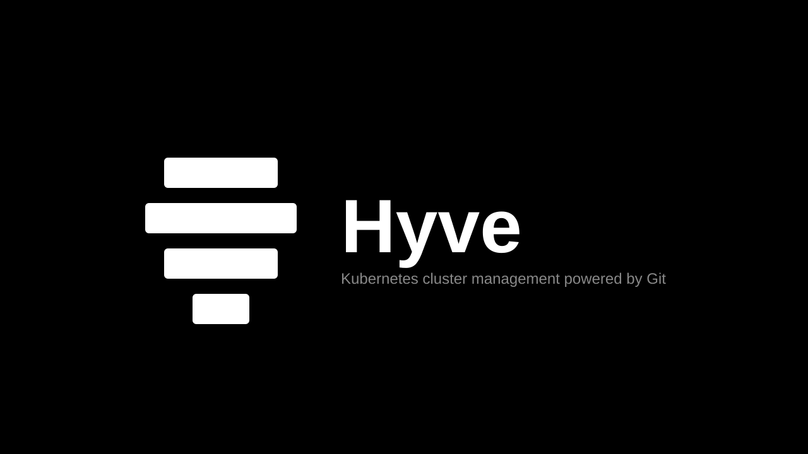

<p align="center">
  
</p>

# Hyve - GitOps Kubernetes Cluster Management CLI

A declarative GitOps Kubernetes cluster management tool with multi-cloud support (Civo, AWS EKS, GCP GKE, Azure AKS), multi-repository support, automated workflows, and secure credential management.

[](https://docs.hyve.dev)
[](LICENSE)

## Features

- **GitOps Native** - All cluster state managed through Git repositories
- **Multi-Repository** - Separate repos for dev/staging/prod environments
- **Automated Workflows** - Define deployment pipelines with requirements validation
- **Cluster Templates** - Reusable cluster patterns with automated workflows
- **Secure Credentials** - AES-GCM encrypted storage for tokens and kubeconfigs
- **Variable Substitution** - Full shell support with workflow and environment variables

## Quick Start

```bash
# 1. Build Hyve
go build -o hyve .

# 2. Configure authentication for your cloud provider
# For Civo (stores encrypted token in Hyve):
./hyve config set-token civo --account default

# For AWS, GCP, or Azure (use native CLI authentication):
# aws configure                              # AWS
# gcloud auth application-default login      # GCP
# az login                                   # Azure

# 3. Set up Git repository
./hyve git add production --repo-url https://github.com/company/hyve-prod.git

# 4. Create a cluster (specify provider)
./hyve cluster add my-cluster --provider civo --region PHX1 --nodes g4s.kube.medium
# or
./hyve cluster add my-cluster --provider aws --region us-east-1 --nodes t3.medium
# or
./hyve cluster add my-cluster --provider gcp --region us-central1 --nodes e2-medium
# or
./hyve cluster add my-cluster --provider azure --region eastus --nodes Standard_D2s_v3

# 5. Run a workflow
./hyve workflow run deploy-app --cluster my-cluster
```

## Installation

### Prerequisites

- Go 1.21 or higher
- Git (required - Hyve uses system git by default for easier onboarding)
- One or more cloud provider accounts:
  - **Civo**: API token (stored encrypted in Hyve)
  - **AWS**: AWS CLI configured (`aws configure`)
  - **GCP**: gcloud CLI authenticated (`gcloud auth application-default login`)
  - **Azure**: Azure CLI authenticated (`az login`)

### Build from Source

```bash
git clone <repository-url>
cd hyve
go build -o hyve .
```

### Configure

```bash
# Verify git is available (required for default backend)
git --version

# Configure cloud provider authentication:

# Option 1: Civo (token stored encrypted in Hyve)
./hyve config set-token civo --account default
# Or for multiple Civo accounts:
./hyve config set-token civo --account production
./hyve config set-token civo --account development

# Option 2: AWS (uses native AWS CLI authentication)
aws configure
# Required environment variable:
# - AWS_ACCESS_KEY_ID (or ~/.aws/credentials)
# - AWS_SECRET_ACCESS_KEY (or ~/.aws/credentials)

# Option 3: GCP (uses Application Default Credentials)
gcloud auth application-default login
# Required environment variable:
# - GCP_PROJECT_ID or GOOGLE_CLOUD_PROJECT

# Option 4: Azure (uses Azure CLI authentication)
az login
# Required environment variables:
# - AZURE_SUBSCRIPTION_ID
# - AZURE_RESOURCE_GROUP

# Configure Git credentials (for private repos)
./hyve git credentials --username your-username --password your-token

# Add your first repository
./hyve git add production --repo-url https://github.com/company/hyve-state.git
```

<details>
<summary>Optional: Use built-in git library</summary>

By default, Hyve uses your system's git command for easier onboarding. If you prefer the built-in go-git library:

```bash
# Set to built-in git (persisted in config)
./hyve config set-git-backend builtin

# Or switch back to system git
./hyve config set-git-backend system

# Check current backend
./hyve config get-git-backend
```

The preference is stored in `~/.hyve/config.yaml` and persists across sessions.
</details>

## Documentation

📚 **[Full Documentation](https://docs.hyve.dev)**

- [Quick Start Guide](https://docs.hyve.dev/quickstart)
- [Installation](https://docs.hyve.dev/installation)
- [Configuration](https://docs.hyve.dev/configuration)
- [Git Management](https://docs.hyve.dev/guides/git-management)
- [Cluster Management](https://docs.hyve.dev/guides/cluster-management)
- [Workflows](https://docs.hyve.dev/workflows/overview)
- [Templates](https://docs.hyve.dev/guides/template-management)
- [CLI Reference](https://docs.hyve.dev/cli/overview)

## Key Concepts

### Repositories

Git repositories store cluster definitions, workflows, and templates:

```bash
hyve git add production --repo-url https://github.com/company/hyve-prod.git
hyve git add development --repo-url https://github.com/company/hyve-dev.git
hyve git use production
```

### Clusters

Define Kubernetes clusters as YAML files:

```yaml
# Civo cluster
apiVersion: v1
kind: Cluster
metadata:
  name: production
  region: PHX1
spec:
  provider: civo
  nodes:
    - g4s.kube.large
    - g4s.kube.large
---
# AWS EKS cluster
apiVersion: v1
kind: Cluster
metadata:
  name: production
  region: us-east-1
spec:
  provider: aws
  nodes:
    - t3.large
    - t3.large
---
# GCP GKE cluster
apiVersion: v1
kind: Cluster
metadata:
  name: production
  region: us-central1
spec:
  provider: gcp
  nodes:
    - e2-standard-4
---
# Azure AKS cluster
apiVersion: v1
kind: Cluster
metadata:
  name: production
  region: eastus
spec:
  provider: azure
  nodes:
    - Standard_D2s_v3
```

### Workflows

Automate deployments with requirements validation:

```yaml
apiVersion: v1
kind: Workflow
metadata:
  name: deploy-app
spec:
  requirements:
    tools:
      - name: kubectl
        version: "1.28"
    secrets:
      - name: DOCKER_TOKEN
        provider: docker
  jobs:
    - name: deploy
      steps:
        - name: apply
          command: kubectl apply -f manifests/
```

### Templates

Reusable cluster configurations with workflows:

```bash
# Create template
hyve template create prod-template \
  --region NYC1 \
  --nodes g4s.kube.large,g4s.kube.large,g4s.kube.large \
  --workflows setup-monitoring,deploy-app

# Execute template
hyve template execute prod-template prod-cluster-01
```

## CLI Commands

| Command | Description |
|---------|-------------|
| `hyve git` | Manage Git repositories |
| `hyve cluster` | Manage cluster definitions |
| `hyve workflow` | Run and manage workflows |
| `hyve template` | Manage cluster templates |
| `hyve kubeconfig` | Manage cluster kubeconfigs |
| `hyve config` | Configure API tokens and provider settings |
| `hyve config gcp` | Manage GCP provider configuration |
| `hyve config aws` | Manage AWS provider configuration |
| `hyve config azure` | Manage Azure provider configuration |
| `hyve reconcile` | Reconcile cluster state |

### Provider Configuration Commands

Store provider-specific configurations in your repository for team sharing:

```bash
# GCP - Add project IDs
hyve config gcp add-project-ids my-project-1,my-project-2
hyve config gcp list-project-ids
hyve config gcp remove-project-ids my-project-1

# AWS - Add account IDs
hyve config aws add-account-ids 123456789012,987654321098
hyve config aws list-account-ids
hyve config aws remove-account-ids 123456789012

# Azure - Add subscription IDs
hyve config azure add-subscription-ids sub-id-1,sub-id-2
hyve config azure list-subscription-ids
hyve config azure remove-subscription-ids sub-id-1
```

Provider configurations are stored in `provider-configs/` in your repository and can be committed to Git.

See [CLI Reference](https://docs.hyve.dev/cli/overview) for complete command documentation.

## Storage

Hyve stores all data in `~/.hyve/`:

```
~/.hyve/
├── repositories.db      # Repository configurations (SQLite)
├── credentials.db       # Encrypted Civo tokens and Git credentials (AES-GCM)
├── kubeconfigs.db      # Encrypted cluster kubeconfigs (AES-GCM)
├── temp/               # Temporary kubeconfig files
└── repositories/       # Cloned repository storage
    ├── production/
    │   ├── clusters/         # Cluster YAML files
    │   ├── workflows/        # Workflow definitions
    │   ├── templates/        # Cluster templates
    │   └── provider-configs/ # Provider-specific configuration
    │       ├── gcp.yaml      # GCP project IDs
    │       ├── aws.yaml      # AWS account IDs
    │       └── azure.yaml    # Azure subscription IDs
    └── development/
```

## Testing

```bash
# Run all tests
go test ./...

# Run tests with coverage
go test ./... -cover

# Run specific package tests
go test ./internal/credentials -v
go test ./internal/workflow -v
```

## Contributing

1. Fork the repository
2. Create a feature branch
3. Make changes and test locally
4. Submit a pull request

## License

[Add your license here]

## Support

- **Documentation**: [https://docs.hyve.dev](https://docs.hyve.dev)
- **Issues**: [GitHub Issues](https://github.com/your-org/hyve/issues)
- **Community**: [Discord](https://discord.gg/your-discord)

---

For detailed documentation, visit **[docs.hyve.dev](https://docs.hyve.dev)**
